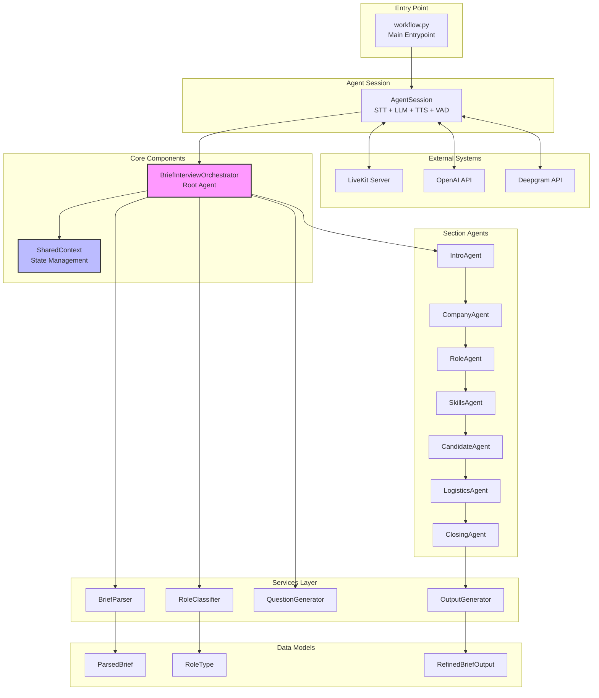
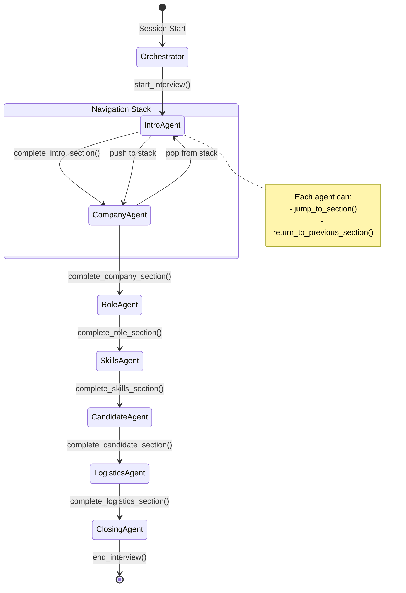
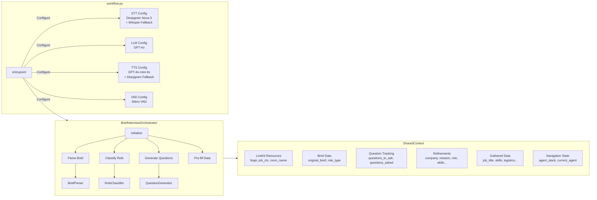
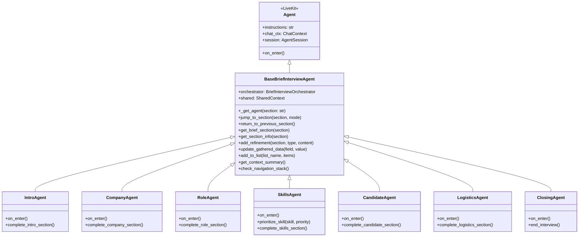
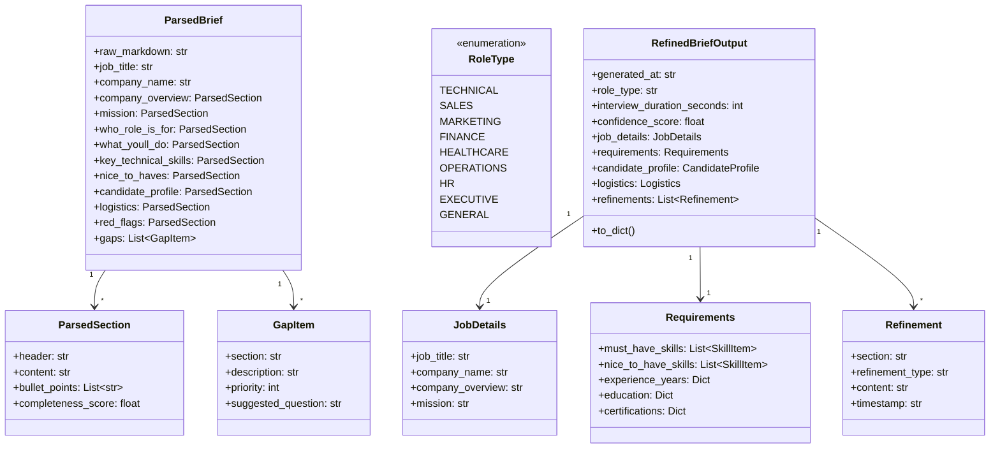
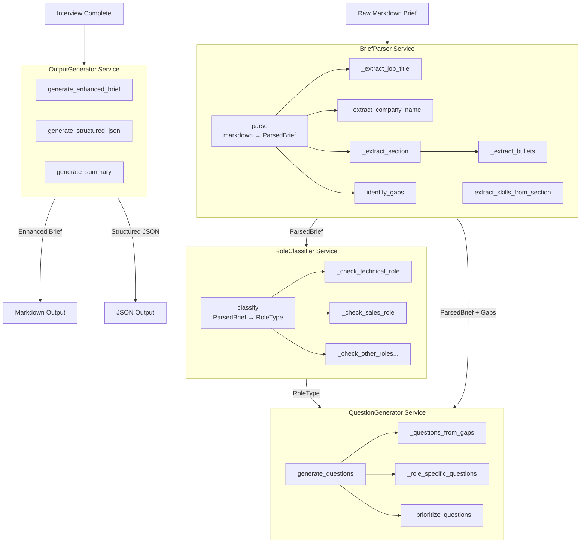
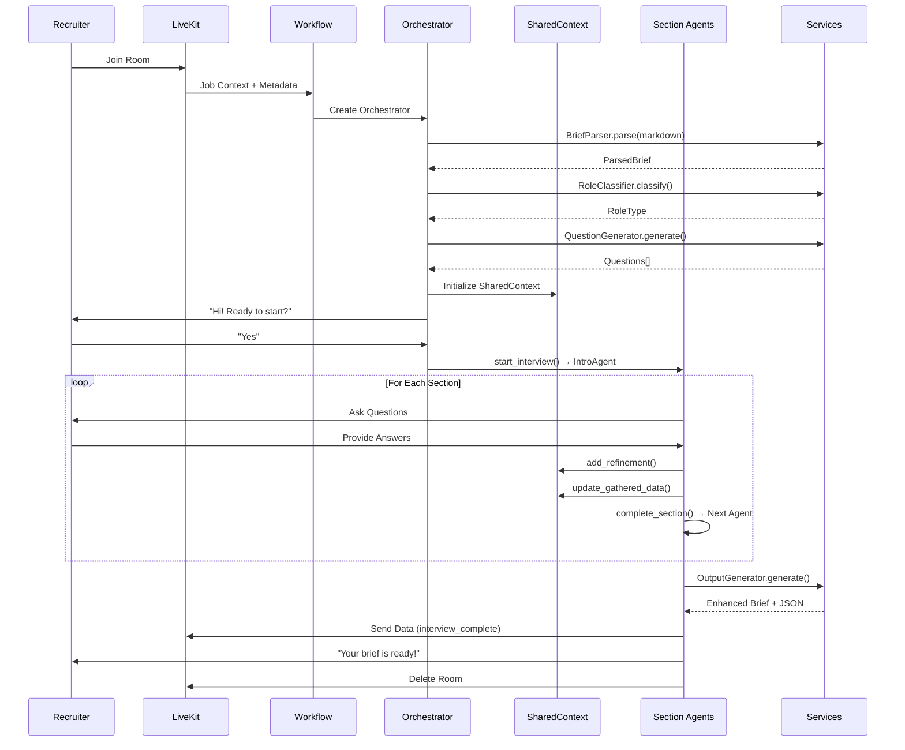
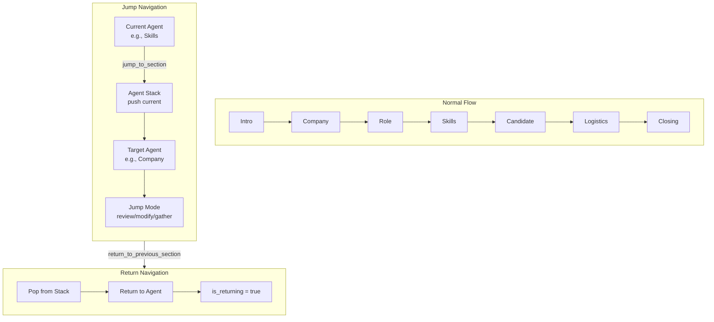
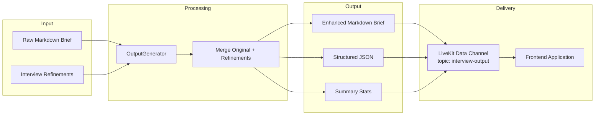

# JD Interview Workflow - Architecture Documentation

## Overview

The JD Interview Workflow is a voice-based AI interview system built on LiveKit that refines auto-generated job description briefs through conversational interviews with recruiters.

---

## 1. High-Level System Architecture



---

## 2. Agent Flow & State Transitions



---

## 3. Detailed Component Architecture



---

## 4. Agent Inheritance & Tools



---

## 5. Data Models



---

## 6. Services Architecture



---

## 7. Interview Flow Sequence



---

## 8. Navigation & Jump System



---

## 9. Folder Structure

```
agents/jd_interview_workflow/
├── __init__.py
├── workflow.py              # Main entry point, AgentSession config
├── orchestrator.py          # BriefInterviewOrchestrator root agent
├── shared_context.py        # SharedContext state management
│
├── agents/                  # Section-specific agents
│   ├── __init__.py
│   ├── base_agent.py        # BaseBriefInterviewAgent with common tools
│   ├── intro_agent.py       # Introduction & greeting
│   ├── company_agent.py     # Company & mission clarification
│   ├── role_agent.py        # Role responsibilities
│   ├── skills_agent.py      # Technical skills prioritization
│   ├── candidate_agent.py   # Ideal candidate profile
│   ├── logistics_agent.py   # Location, salary, timeline
│   └── closing_agent.py     # Summary & output generation
│
├── models/                  # Data models & schemas
│   ├── __init__.py
│   ├── brief_schema.py      # ParsedBrief, ParsedSection, GapItem
│   ├── role_types.py        # RoleType enum
│   └── output_schema.py     # RefinedBriefOutput, Refinement, etc.
│
├── prompts/                 # Agent prompts & instructions
│   ├── __init__.py
│   ├── about_interviewer.py # Interviewer persona
│   ├── base_instructions.py # Common instructions
│   ├── intro_prompt.py
│   ├── company_prompt.py
│   ├── role_prompt.py
│   ├── skills_prompt.py
│   ├── candidate_prompt.py
│   ├── logistics_prompt.py
│   └── closing_prompt.py
│
├── services/                # Business logic services
│   ├── __init__.py
│   ├── brief_parser.py      # Parse markdown → ParsedBrief
│   ├── role_classifier.py   # Classify role type
│   ├── question_generator.py# Generate interview questions
│   └── output_generator.py  # Generate final outputs
│
└── test_runner.py           # Testing utilities
```

---

## 10. Key Design Patterns

### Pattern 1: Agent Handoff
Each section agent returns the next agent from its completion tool, enabling seamless transitions.

### Pattern 2: Shared Context
All agents share a single `SharedContext` instance for state management, avoiding prop-drilling.

### Pattern 3: Navigation Stack
Agents can jump to any section and return using a stack-based navigation system.

### Pattern 4: Tool-Based Actions
All agent actions (data updates, navigation, section completion) are exposed as `@function_tool()` for LLM control.

### Pattern 5: Service Layer
Business logic (parsing, classification, question generation, output generation) is decoupled into services.

---

## 11. Technology Stack

| Component | Technology |
|-----------|------------|
| Voice Framework | LiveKit Agents SDK |
| Speech-to-Text | Deepgram Nova-3 (primary), OpenAI Whisper (fallback) |
| LLM | OpenAI GPT-4o |
| Text-to-Speech | OpenAI GPT-4o-mini-tts (primary), Deepgram Aura (fallback) |
| Voice Activity Detection | Silero VAD |
| Noise Cancellation | LiveKit BVC |

---

## 12. Output Flow


